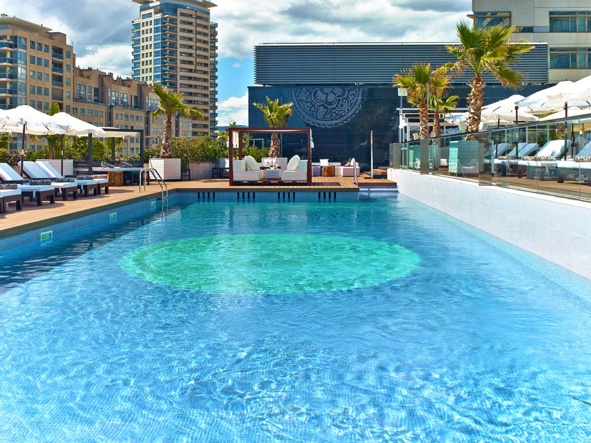
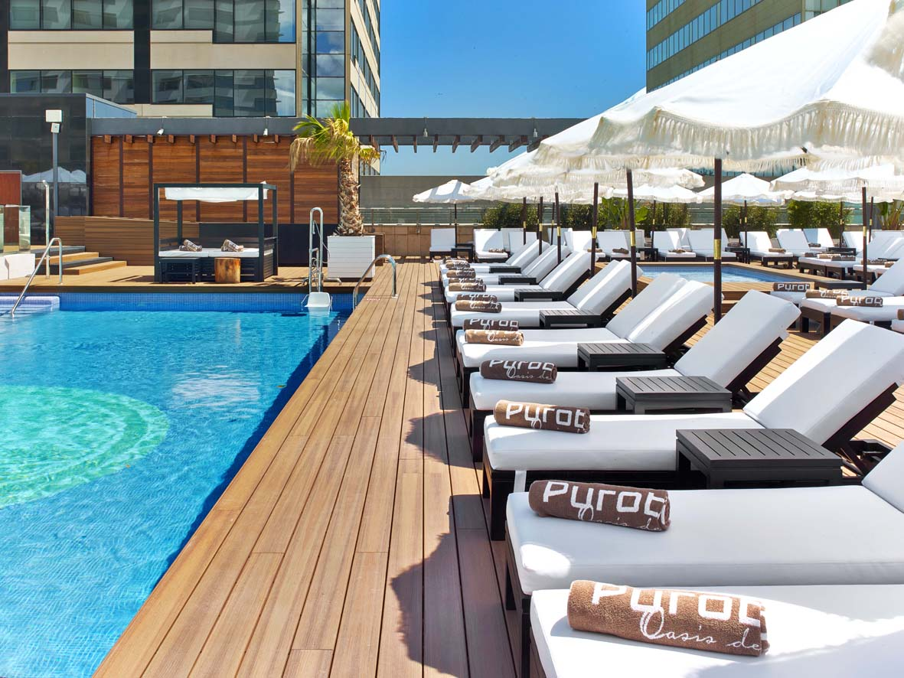
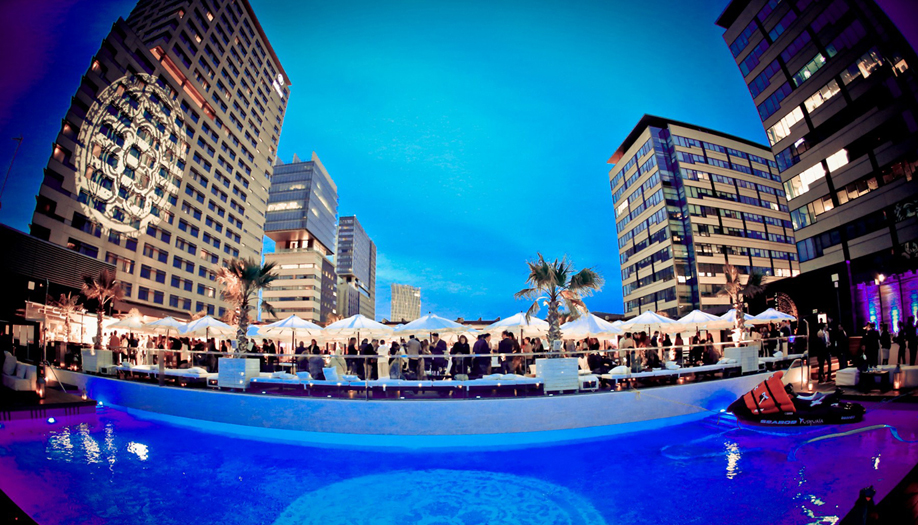
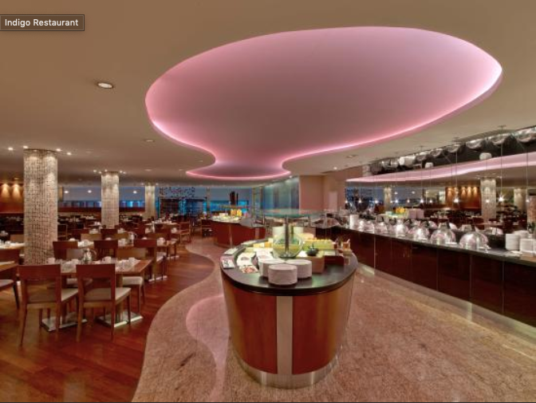
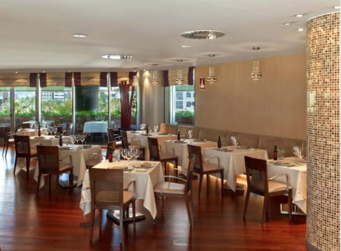
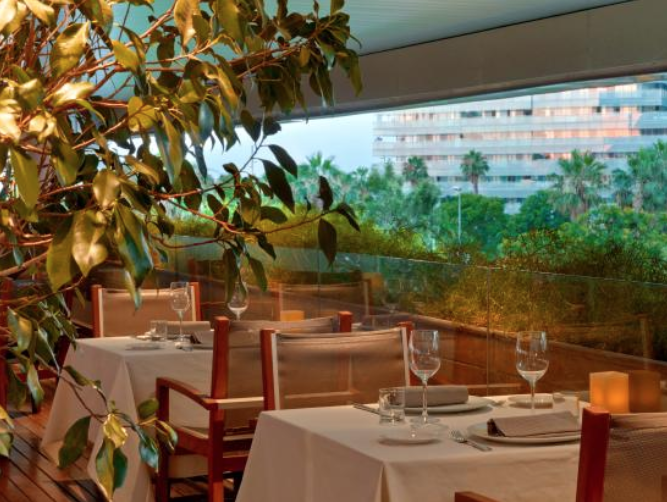

<script> 
    $(document).ready(function() { 
    $head = $('#header'); 
    $head.prepend('<A href = https://www.cuttingedge-events.com></A>') 
    }); 
</script> 

```{r setup, include=FALSE}
knitr::opts_chunk$set(echo = FALSE, message=FALSE, warning=FALSE)
```


```{r libraries}
library(readxl)
library(dplyr)
library(knitr)
library(timevis)

```

## **Puro Beach Barcelona**


**Puro Beach** is located at the Hilton Diagonal's terrace just 3 minutes walking from Hotel Barcelona Princess. But is not central located and there are no nightclubs in the area for the afterparty (in case guests would like to).


To go to **El Principal** you will need bus transfer from the hotel but it is located between Passeig de Gràcia and Rambla Catalunya, two of the most important streets of the city, so you will find a lot of bars and nightclubs near the restaurant as **Sutton** or **Bling Bling**, for example...
You can see it on the map below:

<iframe src="https://www.google.com/maps/d/embed?mid=1o65Rnwm97T9EHCxZJd0rAj8VtsUAQ5uP&hl=es" width="100%" height="480"></iframe>

**Puro Beach** is a breathtaking place to enjoy a BBQ or Cocktail dinner around the pool and enjoy relaxed chill-out music and some drinks after dinner but **the music is allowed only until 22.00h**,the hotel has its own DJ and the maximum volum has to be 75ddB (A) after this hour they can stay but without music...  

The huge terrace of the hotel Hilton Diagonal Mar has different areas. The Puro Beach area is the swimmingpool area, here you can see some pictures: 







**IMPORTANT NOTE**:In the other area (La Pergola) will be another event. We won't be mixed but they will see each others.

As backup, in case of bad weather, the option would be to do the dinner at **Restaurant Indigo**. It is located at the hotel's first floor and it has a terrace (small) that will allow to prepare the BBQ menu.





****

Puro Beach offers different set menus, but we would recommend to choose one of the BBQ menus that are very suitable for this kind of atmosphere:

### MENU OPTIONS  {.tabset .tabset-fade}

#### PURO BBQ
    
    FOOD STATION
    · Mix of lettuces, tomato, peppers, grated carrot, olives, hard-boiled egg, corn in grain, palm hearts, asparagus.
    · Summer potato salad with tuna
    · Greek salad with dressing
    · Hummus with bread spikes
    
    BBQ
    · hicken thighs marinated in Cajun
    · Butifarra de Pagès (Catalan pork sausage)
    · Beef skewers
    · Angus burgers with their condiments
    
    GARNISHES
    · Grilled vegetables
    · Baked potatoes
    
    SAUCES
    · All i Oli
    · Mayonnaise
    · BBQ sauce
    · Tartare sauce
    · Vinaigrettes
    
    DESSERTS
    
    · Chocolate brownie 70% cocoa
    · Carrot cake
    · Crème brulee
    · Fresh laminated fruit
    
    Rates: 59€ VAT inc 
    Drinks not included (1,5h duration)

#### PURO BBQ DELUXE
    
    FOOD STATION
    · Mix of lettuces, tomato, peppers, grated carrot, olives, hard-boiled egg, corn in grain, palm hearts, asparagus
    · Spinach salad with mango, orange grapefruit, cashews and sage oil
    · Salad of roasted peppers with sherry vinaigrette
    · Fattoush salad with pomegranate, pepper, tomato, onion, lime and lemon vinaigrette
    · Manchego cheese marinated with extra virgin olive oil
    · Shrimp ceviche
    
    BBQ
    · Mini entrecôte
    · Squids Skewer
    · Prawns brochette
    · Marinated Tandoori Chicken skewer
    · Cajun Salmon
    
    GARNISHES
    · Grilled vegetables
    · Baked potatoes
    
    SAUCES
    · All i Oli
    · Mayonnaise
    · BBQ sauce
    · Tartare sauce
    · Vinaigrettes
    
    DESSERTS
    
    · Catalan cream puff pastry & fruits
    · Chocolate mousse
    · Cheescake
    · Almond cake with maple syrup
    · Fruit skewers
    
    Rates: 81€ VAT inc 
    Drinks not included (1,5h duration)
    
#### COCKTAIL RECEPTION

    COLD TAPAS
    · Glass of lettuce with Gorgonzola cheese and nuts
    · Mini wheat tart with branded cod and pine nuts
    · Tartar cup of tomato and prawns with crispy Parma cheese
    · Tikka Masala chicken cake pops
    · Salmon cake pops with guacamole
    · Classic Hummus with paprika oil and spiced bread stick
    · Poke salad with tuna and Hawaiian salt
    · Coca bread with ham and tomato
    · Shrimp ceviche with lemon lime
    · Vegetable wrap with spinach, beetroot Hummus, avocado and lettuce
    
    HOT TAPAS
    · Croquettes of ham or cod
    · Crunchy prawns with yellow pepper
    · Crunchy chicken sticks with Romesco sauce
    · Delhi vegetable samosas with mint sauce
    · Mini pita bread with beef and barbecue sauce
    · Mini pita bread with duck confit, apple and yogurt sauce
    · Serranitos stuffed with veal (sirloin)
    · Mini green bao bread stuffed with sautéed asparagus and mushrooms
    · Mini bao bread stuffed with red pesto and mozzarella
    · Mini white classic bao bread stuffed with Andalusian calamari
    · Glass of leeks cream with sautéed scallops
    · Mini quesadillas with jalapeños peppers
    · Gyozas of octopus / Mexican chicken / vegetables
    
    DESSERTS
    · Mini Crêpes filled with vanilla ice cream and chocolate sauce
    · Mini ginos
    · Brownie (gluten free) with English cream
    · Strawberries Panna cotta with chantilly
    · 70% chocolate mousse with candied orange
    · Catalan cream with passion fruit
    · Profiteroles stuffed with truffle
    · Opera cake
    · Creamy violet mousse with "mel i mató"
    · Carrot cake with frosting
    
    13 TAPAS TO CHOOSE (5 cold + 5 hot + 3 desserts): 69€ VAT inc
    Duration 1h pass around service / Supplement for every extra piece 5€ / Drinks not included

****
### DRINK PACKAGES  {.tabset .tabset-fade}

#### PURO SELECTION

    Blanc de Pacs (D.O. Penedès, España)
    Macabeu, Xarel-lo, Parellada
    Mas Petit (D.O. Penedès, España)
    Cabernet Sauvignon, Garnacha
    Ros de Pacs (D.O. Penedès, España)
    Merlot, Syrah, Cabernet Sauvignon
    Beer
    Soft drinks
    Still and sparking water
    Coffee
    
    Rates per person (1.5h): 31€ VAT inc
    
#### PURO QUALITY

    Blanc de Pacs (D.O. Penedès, España)
    Macabeu, Xarel-lo, Parellada
    Mas Petit (D.O. Penedès, España)
    Cabernet Sauvignon, Garnacha
    Ros de Pacs (D.O. Penedès, España)
    Merlot, Syrah, Cabernet Sauvignon
    Beer
    Soft drinks
    Still and sparking water
    Coffee
    
    Cava (Parellada, Viura / Macabeo, Xarello - D.O. Penedès)
    House gin & tonics
    Aperol spritz

    Rates per person (1.5h): 47,50€ VAT inc


*****


## Terms & Conditions

  * Rates valid for 2019.
  
  * Net rates for CICERON
  
  * For a group of minimum 300 pax.
  
  * Cutting Edge Events management fee including in the detailed rates
  
  * VAT included. 
  
  * Space blocked - Release date: August 15th, 2019
  
*****


